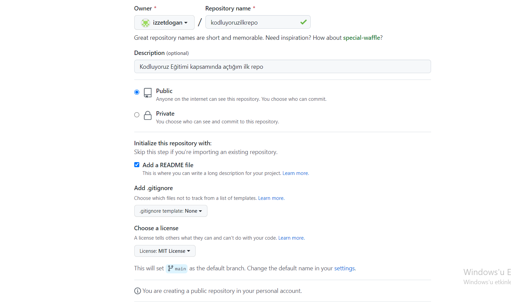

# Kodluyoruz Ilk Repo
Bu repo <a href="https://kodluyoruz.org/tr/kodluyoruz/">Kodluyoruz </a>Front-End Eğitiminde oluşturduğumuz ilk repo. İçerisinde bir adet README dosyası, 
bir adet de index.html barındırıyor.




## Installation
Öncelikle projeyi clonelayın. (Buraya sizin reponuzdan aldığınız link gelecek)
```
git clone https://github.com/izzetdogan/kodluyoruzilkrepo.git
```


## Usage
Projeyi cloneladıktan sonra Visual Studio Code programında açınız.

Linux için:


```
cd kodluyouruzilkrepo
code .
```

## Contributing
Pull requestler kabul edilir. Büyük değişiklikler için, lütfen önce neyi değiştirmek istediğinizi tartışmak için bir konu açınız.

## License
<a href="https://choosealicense.com/licenses/mit/">MIT</a>